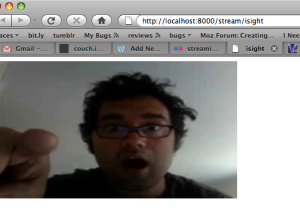

I wanted to do a demonstration of live streaming using the [<video/> tag](https://developer.mozilla.org/en/html/element/video) for [my talk at the upcoming Open Source Bridge conference](http://opensourcebridge.org/sessions/251); maybe a stream a surprise guest in, do some audience interaction, something fun. I figured the easiest way to test the streaming myself would be to use the webcam in my MacBook Pro's built-in iSight camera.

I pinged [Asa](http://weblogs.mozillazine.org/asa/) to get details about how he streams [Air Mozilla](http://air.mozilla.com/), which brought Icecast into the picture. I found some old posts about using VLC on Linux to capture the external iSight, so tried it... but no dice, the capture module barfed when trying to talk to the camera. VLC ships with a capture module for the iSight, but hasn't been updated to work with the internal iSight. Bah. VLC also supported transcoding to Ogg Theora, as well as streaming to Icecast servers, so it really seemed like it'd provide just about everything, if it only supported the camera.

I looked up the error I got from VLC, posted on the VLC forums, no answers. So I emailed the author of VLC's Quicktime module, [Pierre d'Herbemont](http://www.ohloh.net/accounts/pdherbemont), at the email he left in the source file. After a couple of emails, and less than 24 hours later, [he'd checked in a fix](http://git.videolan.org/?p=vlc.git;a=commitdiff;h=d032b62bfaada60a4f3e0b3b2a5a71f65bf8eea9). Open source FTW. Thanks Pierre.

The steps to get it working are enumerated below. At some point, the VLC fix will ship, but until then you'll need to use nightly builds.

Install and configure the Icecast2 server:

1.  Install [MacPorts](http://www.macports.org/)
2.  In the Terminal: sudo port install icecast2. This installs everything into various dirs in /opt/local.
3.  Edit /opt/local/etc/icecast.xml, set user/group it runs as (for logfiles, i set mine to _www, same as Apache), and change the default passwords in the authentication section.
4.  Set permissions on /opt/local/var/log/icecast to be writable by the user you configured Icecast to run as.
5.  In the Terminal, start the server: sudo icecast -c /opt/local/etc/icecast.xml -b
6.  Test your install by checking the server's status at [http://localhost:8000/status.xsl](http://localhost:8000/status.xsl)
7.  Watch the log in the Terminal: tail -f opt/local/var/log/icecast/error.log (Useful for confirming VLC access, as well as catching authentication problems)
Start the stream:

1.  Download and install the most recent [VLC nightly build](http://nightlies.videolan.org/build/macosx-intel/?C=M\%3BO=D)
2.  Open the terminal, and execute the command below
3.  Open [http://localhost:8000/stream/isight](http://localhost:8000/stream/isight) with Firefox 3.5b4 (or newer)
VLC Command (all one line):

/Applications/VLC.app/Contents/MacOS/VLC qtcapture:// --sout="\#transcode\{vcodec=theora,vb=256,venc=theora,acodec=vorbis,ab=64,aenc=vorbis\}: standard\{access=shout,mux=ogg,dst=source:yourpassword@localhost:8000/stream/isight\}"

It's still not quite ready for practical use:

*   There's still some size distortion, maybe I have the aspect ratio wrong or something
*   Still working on sound
*   Lag is pretty bad