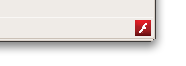

Flash was chewing CPU in one of my myriad tabs, so I used [Jetpack](https://jetpack.mozillalabs.com/) and the new [AddonsManager API](https://developer.mozilla.org/en/Addons/Add-on_Manager) to whip up a quick add-on to enable and disable Flash quickly. It's <30 lines of code and an image. It puts an icon in the Firefox 4 add-on bar that toggles the plug-in, and sends a Growl notification (or whatever system your OS uses) indicating that the plug-in was successfully enabled or disabled. Screenshot:

[Install FlashToggle.](https://addons.mozilla.org/en-US/firefox/addon/260486/) Requires Firefox 4 beta 7 or newer.

[Clone and make your own on the Add-on Builder.](https://builder.mozillalabs.com/addon/1004584/latest/) This might require a minor change in the code since I built using Jetpack 0.10, which isn't released yet. Changing 'contentURL' to 'image' in the widget options should do the trick.

The entire code listing:
<pre>function toggleFlash(callback) \{
  const \{ Cu \} = require("chrome");
  Cu.import("resource://gre/modules/AddonManager.jsm", this);
  AddonManager.getAddonsByTypes(["plugin"], function(addons) \{
    for (let i = 0; i < addons.length; i++) \{
      if (addons[i].name == "Shockwave Flash") \{
        addons[i].userDisabled = !addons[i].userDisabled;
        callback(addons[i].userDisabled);
        break;
      \}
    \}
  \});
\}

let flashLogoURL = require("self").data.url("flash-logo.jpg");
require("widget").Widget(\{
  label: "Toggle Flash",
  contentURL: flashLogoURL,
  onClick: function() \{
    toggleFlash(function(disabled) \{
      let message = "Flash is now " + (disabled ? "disabled" : "enabled") + ".";
      require("notifications").notify(\{
        title: message,
        iconURL: flashLogoURL
      \});
    \});
  \}
\});</pre>