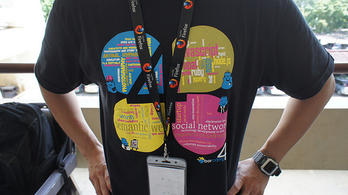

[Barcamp Chiang Mai](http://j.mp/lBy6jz) was last Saturday. Registration was double what we expected, and actual turnout was fantastic. There were great sessions on HTML5, building the Chiang Mai tech community, web platform toolkits for building mobile apps, and many others. I gave a general talk, covering Mozilla as an organization, Firefox 4, and then a quick overview of a bunch of various projects in the Mozilla world. [Slides and links here](http://j.mp/kptswB). Some of the feedback I got from people after this talk:

1.  how little they knew about Mozilla before the talk
2.  how they were going to upgrade to Firefox 4 immediately
3.  or had already upgraded but didn't know about any of the features I covered
4.  had no idea that Mozilla had any projects outside of Firefox
5.  didn't know we had a mobile browser (and were subsequently bummed because it didn't run on their phone)
The geeks didn't know about the [Web Console](http://j.mp/mKASVM), and knew little or hadn't heard about most of the [Mozilla Labs](http://j.mp/mihcyv) projects I mentioned. And most developers that I talk to *still* don't know that Firefox add-ons are written in JavaScript, let alone Firefox itself.

A large number of both geeks and non-geeks were using Firefox 4 but hadn't heard about [App Tabs](http://j.mp/ke2qhf) or [Panorama](http://j.mp/l1hqdm) or Switch-to-Tab. If we don't already, we should probably do user testing to see if [pages like this](http://j.mp/mOH6uu) are actually effective. Or maybe we just need to push them more?

Compared to Apple ([46,000 employees](http://investing.businessweek.com/research/stocks/snapshot/snapshot.asp?ticker=AAPL:US)), Google ([26,000 employees](http://en.wikipedia.org/wiki/Google)) and Microsoft ([89,000 employees](http://en.wikipedia.org/wiki/Microsoft)), we're a tiny penniless rag-tag group. I think we broke 400 employees this year! So slathering whole countries in advertising isn't really an option, and isn't our style anyway. For a long time we've talked about using Firefox itself as a vector for this type of communication, with things like built-in tutorials and introductory wizards for major upgrades. Now that we have [about:home](home), that might be a good place to communicate news about Mozilla the organization, highlighting specific people in the project and important milestones ("500th employee hired!", "One million bugs filed!"). I'm sure the Engagement group is thinking about these things already (RIGHT?!).

Every time I talk about Mozilla publicly, whether at a technology event or to a random person in line at an airport (I always wear a Firefox shirt when traveling!), I meet people that know very little about this piece of software they use every day and the organization behind it. This experience has been the same at US events, everywhere that I've been in SE Asia in the last year, and in Kenya last month as well. We might be a household name, but we've still got a lot of work to do on communicating effectively to both geeks and non-geeks alike.