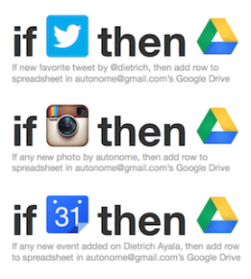

Tweets. Likes. Check-ins. Steps. Photos. Links. We emit a constant stream of content into the sites we use everyday. Is it ours? Well, it feels like it. And according to the terms of service, it kind of belongs to us. Sometimes. Maybe. I don't know, honestly. I don't read those, and likely you don't either. If you fully parse every TOS you encounter, you can stop reading right now, go straight to the nearest IHOP and have some pancakes.

Groups like [IndieWeb](http://indiewebcamp.com/ "IndieWeb") are tackling data ownership issues - experimenting with ways of creating and managing content in a way that bakes in data ownership and removes the need for massive corporate services to achieve Web scale interactions. It's fun and interesting and useful... [we meet every two weeks, come check it out](http://indiewebcamp.com/events/ "Homebrew Website Club")! But an IndieWeb world is a long way off. Especially for non-geeks.

All the companies providing you services today have little interest or incentive to make ownership clear or to make your data portable - the fact that you can't easily move your data around is partially what keeps Google, Facebook, Whatsapp and Pinterest running.

Sure, lots of these services have APIs, through which you could access your data (or at least some of it). But regular users can't really move data around between competing services through APIs. Some of these companies have data export options, where you can download your data in a zip file, but it's not like you're doing that every day. What if today you get banned from Gmail because some process hit a false-positive while enforcing some usage policy? And when was the last time you downloaded all your stuff? Did you ever?

I've always wanted to move to a model where I only participate in services through my own website **first**, and then send a **copy** of my activity to Twitter, Foursquare, Bit.ly through their APIs (including in each request an extra HTTP header containing the URL to the UELA that my content is covered by!). But that will take a while to build, and won't work for devices like my Jawbone UP24 which syncs over a proprietary protocol to native apps only, finally letting me access a subset of my data through their API once it's already on their servers first.

So, back to the point of this post: What can you do _now_?

I've started by attempting to own a copy of as much of my internet output as possible.

Here's how I do it:

1.  Create a Google account, and install the [Google Drive app](https://tools.google.com/dlpage/drive/?hl=en "Google Drive App"). This will keep a local copy of all of your Google Docs on your computer.
2.  Create an [IFTTT](https://ifttt.com "IFTTT") account. IFTTT is a fantastic service that allows a large number of apps, websites, services, devices and all kinds of stuff to interact with each other.
3.  Set up recipes for **everything** you do online that's supported by IFTTT which all add to a Google Docs spreadsheet. I have recipes for Tumblr, Twitter, Bit.ly, Soundcloud and a ton more. I was very surprised by how many services have some bits of my daily personal activity.
That's it. The IFTTT triggers will start firing, the spreadsheets will start filling, and the files will be copied to your local hard drive. You'll now have both an online copy and a local backup of all the stuff you do online.

Here's what some of my IFTTT recipes look like:

IFTTT will save it all in Google docs folder hierarchy for each service:

&nbsp;

I'll be honest - it takes a little while. It's annoying to set up, even with IFTTT's excellently simple user interface. But in the end I own a copy of any new content I post to the services I use. What do I do with it? Nothing at all, right now. But someday maybe those services will shut down, or I'll get banned, or poorly implemented IT backup strategies will wipe it all out. I'll have lost nothing except the time I spent setting this up.

Is it real data portability? Nope. Is it true ownership? No. Hell, "my" content might even be under some crazy license restrictions that I agreed to before putting it up on Pocket or Evernote! But it's always running, and someday my personal weak-AI agent will be able to do something with it.

PS: Do you use Gmail? Do you only use the web interface or Android/iOS apps? Then you probably don't have a backup of your email. I run an IMAP mail client (Thunderbird) periodically to get an updated offline copy of my Gmail in an open format.