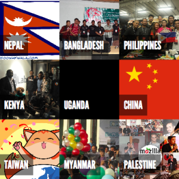

[Atul Varma](https://twitter.com/toolness) set up a [quilt](http://quilts.mozillacamp.org/2012/asia/) for MozCamp Asia 2012 which I thought was a fantastic tool for that type of event. It provided an engaging visualization, was collaboratively created, and allowed a quick and easy way to dive further into the details about the participating groups.

I wanted to use it for a couple of projects, but the code was tied pretty closely to that specific content and layout.

This week I finally got around to moving the code over to Mozilla Webmaker, so it could be easily copied and remixed. I made a couple of changes:

*   Update font to Open Sans
*   Make it easy and clear how to re-theme the colors
*   Allow arbitrary content in squares
The JS code is still a bit too complex for what's needed, but it works on Webmaker now!

[View my demo quilt](https://dietrich.makes.org/thimble/MjAzNzUxNDQ5Ng==/web-quilt). Hit the "remix" button to clone it and make your own.

The source for the core JS and CSS is at [https://github.com/autonome/quilt](https://github.com/autonome/quilt).