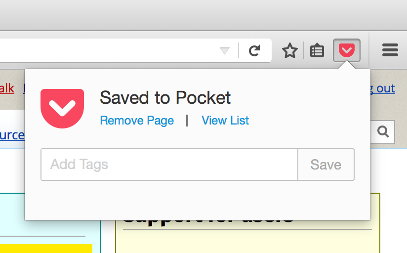

I love **Pocket** and I love **Firefox**.

But two things were driving me batty about the Pocket feature built into Firefox:

1. The design of the popup experience when you save a page to Pocket is... unfortunate. It stays up far too long, **and** it doesn't go away when you switch tabs. Yeah, it stays open for a given URL even when you're on a tab with a completely different URL! But regardless of whether you think that's as crazy as I do, I never want to add tags so just don't need it at all.

2. The Pocket toolbar button doesn't indicate whether you've already saved the page or not. You have to click the button to figure it out. Now this might not be a problem for everyone. But the way I use my browser can best be described as "tabsplosion". I don't know when or where these tabs come from, or how they get there, or whether I saved it already or not. So this tiny piece of ambient visual signal would be useful for me.

So I took a couple of hours over the last few evenings and scratched the itch. I made a Firefox add-on which does the following:

* Adds a new Pocket button to the toolbar. (You can remove the old one by right-clicking it and choosing "Remove from Toolbar"). Mine is red. I want to make one that has nice gold double-stitching on it...

* The new button shows a check mark badge when the page is already saved.

* You can click the button to either add or remove the page from Pocket.

* No popup.

That's it. Simple, clear and out of your way.

[INSTALL HERE (WARNING: Experimental side-project software. You've been warned.)](https://addons.mozilla.org/addon/doublestitch/)

Source code: [https://github.com/autonome/doublestitch](https://github.com/autonome/doublestitch)

If you try it out, let me know if you find any bugs or have any ideas for improvements!