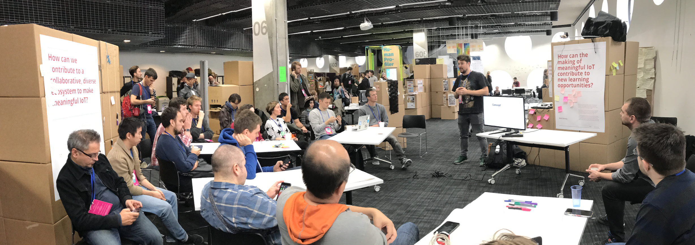
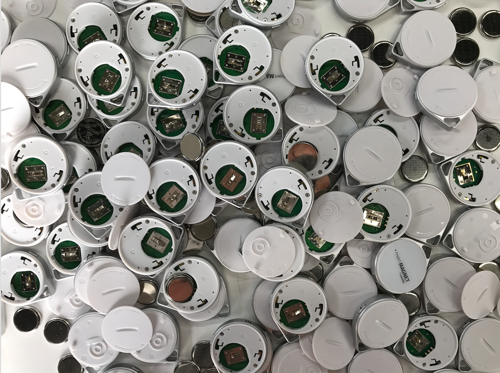
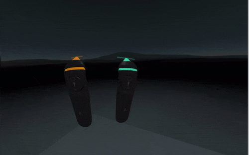
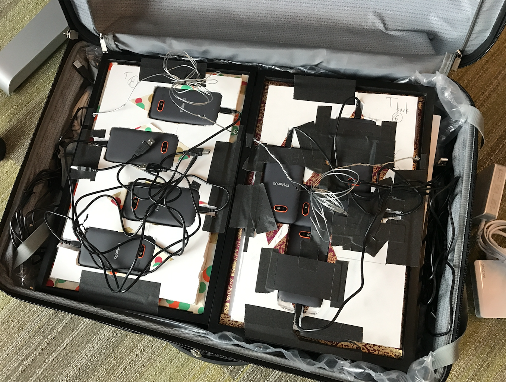
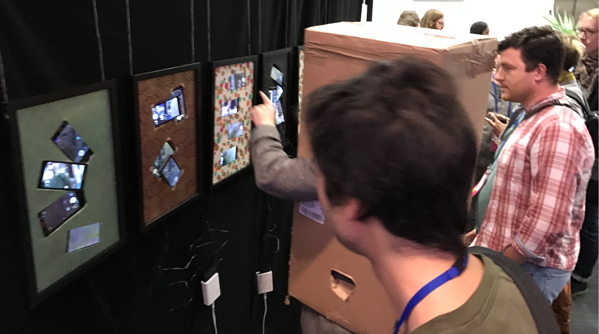
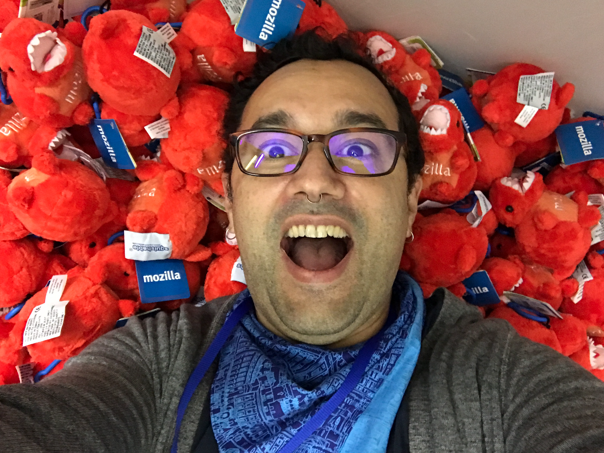

I had the pleasure of being involved in a bunch of different activities at Mozfest this year. What is Mozfest? [From the website:](https://mozillafestival.org/)

> MozFest is an annual celebration of the open Internet movement. It's where passionate technologists, educators, and makers come together to explore the future of the open Web.

Sounds pretty cool... but what does an "annual celebration" of web exploration actually look like? Well, here's something a bit more of a visual:

Imagine an nine-floor open-plan art school in London, completely taken over for a weekend by over 400 artists, designers, activists, teachers, hackers and makers, putting on hundreds of workshops, talks and building and showing interactive art, games and various other exhibits of thrilling wonder.

It's truly spectacular and an overwhelming thing to experience.

My biggest wish for Mozfest is for it to leave London - to transform into a regional distributed series of festivals that bring these wonders to the world outside of London (I hear it exists!). Hopefully that will happen someday.

But for now, read on to learn about some of the spaces, projects and exhibits I participated in this year.

\#\# **Dilemmas in Connected Spaces**

Mozfest is composed of a number of "spaces", most of which are housed on specific floors: Journalism, Science, Arts, Youth, etc. This year I was one of the curators and coordinators of the Dilemmas in Connected Spaces... space.

There are a zillion websites, tutorials, workshops and classes that provide how-to knowledge of IoT, so we decided to not use our space to duplicate those efforts.

Instead, we designed our space to explore the challenges that arise from the ubiquity of connected physical computing devices in our lives. and then built it with 500 cardboard boxes!

 

We divided the space into different zones: The Open IoT Studio, Home, Garden and the Nomad Tent Camp. I decided to explore the dilemma of over-stimulation in our digital lives by running the Nomad Tent Camp, a chill zone where almost nothing was scheduled - a place for weary Mozfest travelers to rest their weary feat, chill out and talk with other explorers. I set up a couple of large spray shelters as tents, and filled the area with comfy chairs. Sure enough, all weekend long we had people coming through and doing naught be relaxing and chatting with strangers they met at this quiet oasis amongst the chaos.

> (Somehow I have no pictures of my own zone! Please use this placeholder to imagine it.)

If you'd like to learn about the rest of the Dilemmas in Connected Spaces activities, you can follow [Jon Rogers](https://twitter.com/ileddigital) and [Michelle Thorne](https://twitter.com/thornet)'s [Open IoT Studio](https://twitter.com/openiotstudio), read about [Ian Forrester](https://twitter.com/cubicgarden)'s [Home space](http://cubicgarden.com/2016/10/23/this-time-next-week-ill-be-at-mozfest-2016/) and hear what [Michael Saunby](https://twitter.com/msaunby) did in the Garden on this [radio interview](https://www.mixcloud.com/Resonance/making-conversations-1-november-2016/).

\#\# **Mozfestation.... GET INFECTED... WITH IDEAS!**

[Katie Caldwell](https://twitter.com/kc_coffeekid), [Liz Hunt](https://twitter.com/ezoehunt) and I worked on a project that came out of their work in the Connected Devices group on [Project Magnet](https://github.com/mozilla-magnet/magnet) and some of my Bluetooth experiments called Mozfestation. We wanted a way to encourage people to explore more of the festival than they would've otherwise - and to get exposed to as many ideas as possible during the weekend. And I had a 100 beacons...

So we made iOS and Android apps for discovering, accessing and saving beacons (a hacked version of Magnet's React Native app, made web pages for 100 curated things at Mozfest, made a leaderboard for showing top-visited beacons and the users who'd seen the most beacons, and then put posters and flyers all over the festival to let people know about it.

In the end, it was a ton of work and a ton of fun. We learned a ton about large-scale beacon deployments, minimum-viable-gamification, mobile app uptake tactics and loads more. It was a huge experiment and it was FASCINATING. There's a lot involved in the design, implementation, festival execution, and the analysis of the data collected, so I'll go over all of that in a separate post.

\#\# **A-Painter: 3D Painting in Virtual Reality!
**

One addition to the space was [Mozilla's A-Painter](https://blog.mozvr.com/a-painter/), a purely web-based virtual reality 3D painting experience. It's a web app written using [A-Frame](http://aframe.io/), the web toolkit for building 3D and VR experiences in the browser. A-Frame is both incredibly powerful and incredibly easy to use, and it was showing up all over the festival, almost anywhere that someone was doing a session or exhibit about VR.

We set up the A-Painter space next to the nomad tent camp, which is on the 6th floor of the school, where the fashion classes are taught. The whole space is littered with mannequins that have paper-prototypes of clothing concepts on them. We clustered a bunch of these around the space and even used two of them to hold the HTC Vive's positional sensors.

https://twitter.com/JoelGethinLewis/status/792388060164067329

\#\# **Vanity Trumps Privacy Trumps Vanity**

Since the demise of Firefox OS, I've been collecting all of the old Flame developer devices that I can get my hands on. These are smartphones, no... *computers*, packed with sensors, and with screens built-in, and with the ability to run applications built using the web stack but with access to WAY more functionality than traditional web pages. I've been using them as IoT devices, art pieces, privacy tools and more. I've been playing around with using them as camera arrays, and have a few side-projects (as yet unfinished) doing things like turning them into piecemeal mega-screens, chandeliers, etc.

So when Kevin Fann started talking about his idea for an exhibit at Mozfest that explored the tension between vanity and privacy, all I could think about was how the selfie is a fantastic expression of that tension, and I've got all these smartphones... no, *cameras* lying around.

Kevin, Jordan Gushwa and I designed a walk-through experience with loads of phones on selfie-mode and even a secret hidden camera that records live video and displays out *outside* the exhibit... so you don't know you're being recorded until *after* you exit.

Kevin created eye-catching frames and placements for all the phones, and selected a few relevant video clips to have repeating on some of the phones. I wrote some code that streamed the live video from the hidden phone over Web-RTC to a Raspberry Pi hooked up to a screen outside the exhibit.

Kevin packed everything up into suitcase, which could not have looked more bomb-like:

Here's a video tour of the wall in all its glory:

https://twitter.com/dietrich/status/792302372861177856

The end-result was epic: People were *mesmerized* by so many phones showing them the live camera view of themselves.

Mozfest 2016. It's over. I'm exhausted. It was a parade of wonders. I hope someday it will come your way.

Cheers.

