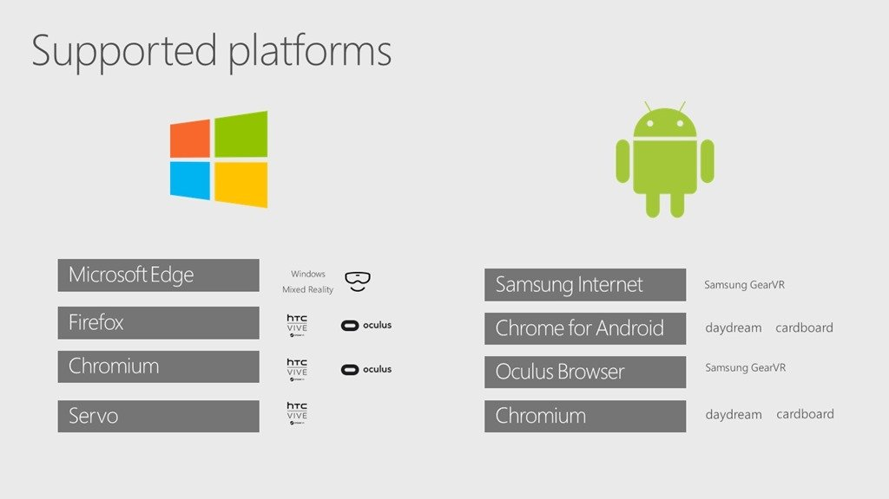

Hello! This guide is written for the [Augmented City AR/VR lab](https://www.eventbrite.com/e/vrar-lab-augmented-city-creating-vr-ar-web-content-showcasing-singapore-tickets-35297738486) in Singapore on July 15th 2017, but might be helpful for anyone looking to jump into A-Frame. The [first post is introduced A-Frame](http://metafluff.com/2017/07/06/aframe-augmented-city/) as a tool for creating 3D content for the web. This post introduces VR on the web. The next and final post in the Augmented City prep series will be about AR on the web.

<blockquote class="instagram-media" data-instgrm-version="7" style=" background:\#FFF; border:0; border-radius:3px; box-shadow:0 0 1px 0 rgba(0,0,0,0.5),0 1px 10px 0 rgba(0,0,0,0.15); margin: 1px; max-width:658px; padding:0; width:99.375\%; width:-webkit-calc(100\% - 2px); width:calc(100\% - 2px);">
 
 

<a href="https://www.instagram.com/p/BVJQaVMgKpX/" style=" color:\#c9c8cd; font-family:Arial,sans-serif; font-size:14px; font-style:normal; font-weight:normal; line-height:17px; text-decoration:none;" target="_blank">A post shared by rockintosh (@rockintosh)</a> on <time style=" font-family:Arial,sans-serif; font-size:14px; line-height:17px;" datetime="2017-06-10T03:52:06+00:00">Jun 9, 2017 at 8:52pm PDT</time>

</blockquote>

\#\# VR

With every passing day, virtual reality is becoming less weird and more a fact of life for developers and designers everywhere.

VR hardware isn't ubiquitous yet, and is actually still both cumbersome and expensive. Momentum is gathering regardless, both in experimentation and business investment.

The web is the largest deployment surface with the least friction for content of any kind. Given the still early stage that VR is at, being able to make it and publish it on the web provides the innovation vector that is required for VR to succeed.

\#\# WebVR

WebVR is a standard for exposing VR hardware capabilities to the software context of web applications, and then rendering the page to that hardware. The specification describes an API in JavaScript for enumerating HMDs and controllers, among other things.

Mozilla, Google and others have been working together over the last couple of years to develop the standard, and are now starting to ship the initial versions. The specification was tagged at version 1.1 but is not yet finalized, so implementations may yet change.

* WebVR spec development is driven by the [W3C WebVR Community Group](https://www.w3.org/community/webvr/)
* [WebVR draft specification on W3C's Github](https://w3c.github.io/webvr/)
* [WebVR API documentation on MDN](https://developer.mozilla.org/en-US/docs/Web/API/WebVR_API)
* Most conversation happens on the [WebVR Slack](https://webvr-slack.herokuapp.com/)

\#\# Browser Support for WebVR

* Firefox: Supported on Windows and Android since version 55 (beta at the time of this post), and in nightly builds on Mac.
* Chrome: Supported, but off by default, need to flip a flag.
* Edge: Supported unprefixed as of build 15002+ on Desktop, Mixed Reality, Mobile and Xbox.
* Safari: Unsupported, but Apple just joined the WebVR community group, so there's a possibility of support but no explicit statement yet.
* Samsung: Supported on Samsung Internet Browser for GearVR.

\#\# Mobile and the WebVR Polyfill

Smartphones can be used for WebVR experiences inside "cardboard" or other devices designed to contain a smartphone for HMD-like experiences.

These most often use the [WebVR Polyfill](https://github.com/googlevr/webvr-polyfill), a JavaScript library created by Google which mimics the WebVR API functionality, rendering the scene for each eye in software. Libraries like Three.js and A-Frame use the polyfill when no hardware is detected.

If you open an A-Frame scene on your mobile phone and touch the HMD icon, the polyfill will kick in and you'll see the scene rendered for each eye separately, and you can then insert the phone inside a VR viewing device.

The polyfill uses the [orientation web API](https://developer.mozilla.org/en-US/docs/Web/API/Detecting_device_orientation), so even responds to your movement, allowing you to look all around within the scene.

\#\# HMD Support

Currently both retail versions of the HTC Vive and the Oculus Rift work with Firefox and Chrome's implementations of WebVR. Instructions for all of these combinations are at [Mozvr.com](https://mozvr.com/\#start).

Microsoft Edge only supports their Mixed Reality hardware at this time.

David Rousset [wrote a great overview](https://www.davrous.com/2017/07/07/from-zero-to-hero-creating-webvr-experiences-with-babylon-js-on-all-platforms/) of writing a WebVR application that works in all hardware platforms, with this excellent visualization of browsers and hardware platforms. One thing to add is Firefox Android also supports WebVR from version 55.

