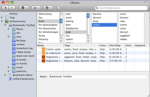

Tag Finder is a Firefox extension that lets you browse your tags in a manner similar to the column view in the Mac OS X Finder. It allows you to view related tags, and to traverse tag relations quickly.

You can enable the view by clicking the tag icon on the toolbar of the bookmarks Library in Firefox 3. Installation does require logging into AMO, as the extension is still experimental.

[Install](https://addons.mozilla.org/en-US/firefox/addon/8056 "Install Tag Finder")

