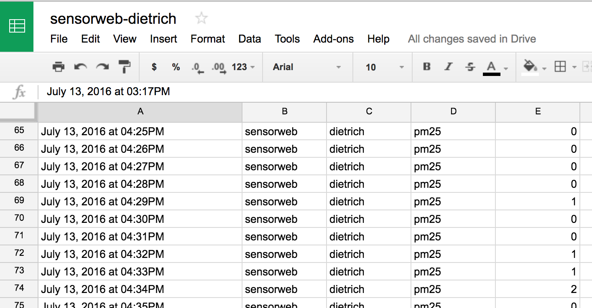

[Project SensorWeb](http://sensorweb.io/) is an experiment from the [Connected Devices](https://wiki.mozilla.org/Connected_Devices/Projects) group at Mozilla in open publishing of environmental data. I am excited about this experiment because we've had some [serious air quality discoveries in Portland](http://topics.oregonlive.com/tag/toxic%20air/) recently - our air is possibly [the worst in the USA](http://koin.com/2016/03/02/study-portland-air-among-worst-in-nation/), and bad enough that [mega-activists like Erin Brockovich are getting involved](http://koin.com/2016/02/26/erin-brockovich-joins-portland-air-quality-fight/).

A couple of weeks ago, Eddie and Evan from Project SensorWeb helped me put together a NodeMCU board and a PM2.5 sensor so I could set up an air quality sensor in Portland to report to their network. They're still setting up the project so I haven't gotten the configuration info from them yet...

But you don't need the SensorWeb server to get your sensor up and running and pushing data to your own server! I want a copy of the data for myself anyway, to be able to do my own visualizations and notifications. I can then forward the data on to SensorWeb.

So I started by flashing the current version of the SensorWeb code to the device, which is a Nodemcu 0.9 board with an ESP8266 wifi chip on board, and a PM2.5 sensor attached to it.

I used [Kumar Rishav's excellent step-by-step post](https://rishav006.wordpress.com/2016/06/22/pm2-5-a-sensorweb-project-by-mozilla/) to get through the process.

Some things I learned along the way:

*   On Mac OS X you need a [serial port driver](https://www.silabs.com/products/mcu/Pages/USBtoUARTBridgeVCPDrivers.aspx) in order for the Arduino IDE to detect the board.
*   After much gnashing of teeth, I discovered that you can't have the PM2.5 sensor plugged into the board when you flash it.
After getting the regular version flashed correctly, I tested with Kumar's API key and device id, and confirmed it was reporting the data correctly to the SensorWeb server.

Now for the changes.

*   I set up [the Maker channel on IFTTT](https://ifttt.com/maker), which allows me post data to an HTTP endpoint to get it into IFTTT's system.
*   I then created a new [IFTTT recipe that accepts the data from the device and pushes it into a Google spreadsheet](https://ifttt.com/recipes/440904-save-pm2-5-data-to-a-spreadsheet).
*   I forked the SensorWeb code and [modified it to post to the Maker channel instead of the SensorWeb server](https://github.com/autonome/arduino-station/blob/master/station/nodemcu/nodemcu.ino).
I flashed the device and viola, it is publishing data to my spreadsheet.

&nbsp;

And now once SensorWeb is ready to take new devices, I can set up a new IFTTT recipe to forward the posts to them, allowing me to own my own data and also publish to the project!