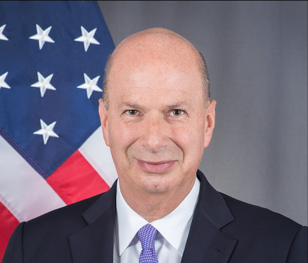
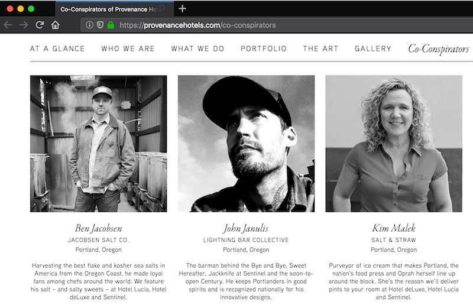

Hey Portland, this one is going to burn a little.

While the global perception of Portland is of a liberal weirdo wonderland, some of our city's beloved bars and world-renowned products and brands are part of the Trump support network in the Pacific Northwest.

Meet Gordon Sondland, who [donated $1,000,000 for Donald Trump inauguration parties](https://www.wweek.com/news/2017/04/21/report-portland-hotel-owner-covertly-steered-cash-to-trump/), and has received the ambassadorship to the EU. Read more about him on [Wikipedia](https://en.wikipedia.org/wiki/Gordon_Sondland).

He's the founder and CEO of [Provenance Hotels](https://provenancehotels.com/who-we-are), a company that owns a group of hotels in the Pacific Northwest, and a few other places around the country..

I started to make a list of these hotels, so I could recommend to people to stay elsewhere. While reading the Provenance website, I found this page:

Whoa. These are some of the most successful names in Portland independent businesses. These are the people who make the things I love, and the spaces and menus I enjoy on a Friday night. What the fuck.

The Provenance website lists these ["co-conspirators"](https://provenancehotels.com/co-conspirators) (their words, not mine... but apt!) in Portland.

I know these businesses aren't evil. But I believe that the world around us is constructed by the decisions we make. So I cannot support these businesses while they partner with Provenance Hotel group and Gordon Sondland.

Please support these businesses by letting them know your concern about the part they play in enriching the people that keep Trump in power, and support a civil society  by spending your money elsewhere until they've stopped doing business with Provenance.

* Jacobsen Salt
* Salt &amp; Straw
* Lightning Bar Collective (Bye and Bye, Sweet Hereafter, Jackknife, Century)
* Quin Candy
* Austin Howe
* Imperial, Vitaly Paley
* Feast Portland
* Steven Smith Teas
* 503 Media and Events, David Rae
* Gemo Wong, Nike

I hope these business will cut ties with Provenance, so I can support them again someday.

## Hotels Owned By Provenance

[Portfolio of Provenance Hotels Group](https://provenancehotels.com/portfolio)

* Portland, OR
  * Hotel deLuxe
  * Hotel Lucia
  * Sentinel
  * Dossier
  * Heathman Hotel 
  * Westin Portland
  * The Benson
* Seattle, OR
  * Hotel Max
  * Hotel Theodore
* Tacoma, WA
  * Hotel Murano
* Nashville, TN
  * Hotel Preston
* New Orleans, LA
  * Old No. 77 Hotel and Chandlery
* Stillwater, MN
  * Lora

## Contribute? Feedback?

Contact Dietrich Ayala ([@dietrich on Twitter](https://twitter.com/dietrich) or https://mastodon.social/@dietrich )

If you're a Portland business owner listed above, and have stopped doing business with Provenance, thank you! Please reach out and I'll add a note about it.
