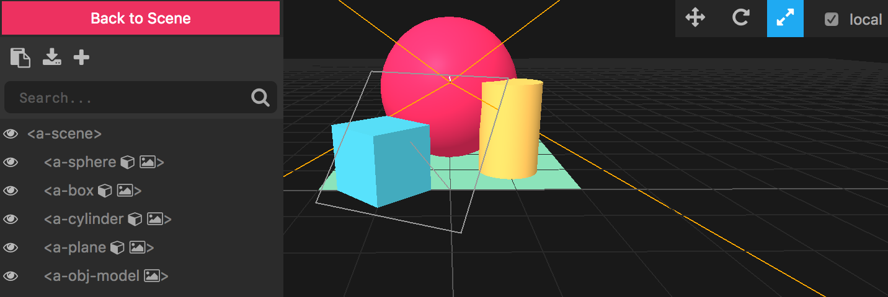

Hello! This guide is written for the [Augmented City AR/VR lab](https://www.eventbrite.com/e/vrar-lab-augmented-city-creating-vr-ar-web-content-showcasing-singapore-tickets-35297738486) in Singapore on July 15th 2017, but might be helpful for anyone looking to jump into A-Frame. This first post will orient you to A-Frame itself, and the couple following will focus on VR and AR. Enjoy!

<blockquote class="instagram-media" data-instgrm-version="7" style=" background:#FFF; border:0; border-radius:3px; box-shadow:0 0 1px 0 rgba(0,0,0,0.5),0 1px 10px 0 rgba(0,0,0,0.15); margin: 1px; max-width:658px; padding:0; width:99.375%; width:-webkit-calc(100% - 2px); width:calc(100% - 2px);">
 
 

<a href="https://www.instagram.com/p/BVJQaVMgKpX/" style=" color:#c9c8cd; font-family:Arial,sans-serif; font-size:14px; font-style:normal; font-weight:normal; line-height:17px; text-decoration:none;" target="_blank">A post shared by rockintosh (@rockintosh)</a> on <time style=" font-family:Arial,sans-serif; font-size:14px; line-height:17px;" datetime="2017-06-10T03:52:06+00:00">Jun 9, 2017 at 8:52pm PDT</time>

</blockquote>

## Augmented City

The Augmented City event is an all-day workshop focused on quickly prototyping AR/VR experiences on the web, and with a theme of Singapore itself.

What does an augmented Singapore look like? What can it do? What can you do in it? Maybe it tells its own story - its history. Maybe it shows you what music is happening nearby, or which hawker stalls you should try. Maybe lets you see [trees that used to be](http://nationalmuseum.sg/exhibitions/exhibition-list/singapore-very-old-tree), or shows visualizations of the [changing waterline](https://en.wikipedia.org/wiki/Port_of_Singapore#/media/File:KITLV_-_150813_-_Lambert_%26_Co.,_G.R._-_Singapore_-_Port_at_Singapore_-_circa_1890.tif) over time as the city grew.

Some more ideas: 

* I love [these visuals from @rockintosh on Instagam](https://www.instagram.com/p/BVl2DJgAwgJ/) - the ArtScience Museum disintegrating and floating away is fantastic. 

* Use public data to create 3D and virtual maps with tools like [Vizicities](https://github.com/UDST/vizicities).

* Vive put up a post with a bunch of [examples of teaching history through VR](https://blog.vive.com/us/2017/05/12/experience-history-in-vr/), and the BBC made [this exploration of the Pantheon in Rome](http://www.bbc.co.uk/taster/projects/romes-invisible-city-vr). I've been playing with a model of Kowloon Walled City in Hong Kong (but it's not ready yet...). What in Singapore's history can you recreate virtually?

* These ["following eyes" from NYPSIDM students](https://www.instagram.com/p/BV9TapglsAq/) here in Singapore are fantastic. Imagiine an AR version, placed all around the city!

* Tell a story about the musical history of Singapore, or showcase contemporary music using AR. I like this use of AR for [scanning record covers to listen and learn more about the music they contain](https://goldcomputing.show/2017/05/30/vinylart/).

* To be honest, I want an AR app that translates the kopitiam menus into something I can understand so I can order coffee the right way... somehow I always order it wrong!

## A-Frame

This guide will help you quickly get up to speed on using A-Frame, Mozilla's library for declarative authoring of 3D content for virtual reality and augmented reality web experiences. The guide contains links to documentation, learning tools, useful components, tips and tools for debugging, and locations for finding help.

## Documentation and Learning

* The [official A-Frame website](https://aframe.io) has documentation and examples.
* [A-Frame School](https://aframe.io/aframe-school) is a short interactive curriculum for learning A-Frame.
* Check out the [A-Frame posts on the Mozilla Hacks blog](https://hacks.mozilla.org/?s=a-frame).
* If you're a podcasty person, check out this [interview with A-Frame core developers](http://voicesofvr.com/538-how-mozilla-is-driving-webvr-content-tooling-with-the-a-frame-framework/) on the Voices of VR podcast, to learn more about how A-Frame got to where it is, and where it's going.

## Start Coding

Glitch.com lets you author and run full web projects, with HTML, CSS, JavaScript and Node.js. Create a free account and you can start hacking on A-Frame right away. If you're a more experienced developer, check out the [A-Frame installation page](https://aframe.io/docs/0.6.0/introduction/installation.html) to add it to your development environment.

* Get started with the [A-Frame Glitch example](http://glitch.com/~aframe). Click the link and choose "Remix your own". Then try moving the objects around, changing their color, or animating them, to get a feel for what A-Frame can do.
* Try remixing some more advanced examples like the [trippy shooting stars](https://glitch.com/~aframe-shooting-stars) or a [webcam circus mirror](https://glitch.com/~aframe-webcam-component).
* Here's a basic [A-Frame example on Codepen](https://codepen.io/mozvr/pen/BjygdO)

## Features and Components

Some basic things to try:

* [Positioning of objects in your scene](https://aframe.io/docs/0.6.0/components/position.html)
* [Animation of objects in your scene](https://aframe.io/docs/0.6.0/core/animations.html)
* [Link traversal - navigating between different VR web pages!](https://aframe.io/docs/0.6.0/components/link.html)

A-Frame's extensibility is an entity component system, which has enabled a huge number of components to be created to add functionality. A few useful modules are listed below. You can [create your own components](https://aframe.io/docs/0.6.0/introduction/writing-a-component.html) also.

* Add physics to your scenes and objects with [Don McCurdy's aframe-physics-system component](https://github.com/donmccurdy/aframe-physics-system). Check out [Belén Albeza's guide to A-Frame physics](https://hacks.mozilla.org/2017/05/having-fun-with-physics-and-a-frame/) on Mozilla's Hacks blog.
* The [A-Frame environment component](https://github.com/feiss/aframe-environment-component) allows you to preconfigure and generate whole worlds.
* [Networked A-Frame](https://github.com/haydenjameslee/networked-aframe) lets you build multi-user easily. Can you think of a way to augment your city by creating social experiences in VR and AR?

Other A-Frame Projects To Try

* Create your own city with the A-Frame [City Builder](https://github.com/kfarr/aframe-city-builder)
* Learn how to build your own [Minecraft in A-Frame](https://css-tricks.com/minecraft-webvr-html-using-frame/)
* Read through this [list of authoring tools](https://docs.google.com/spreadsheets/d/1VRDoN3AgjJbMZmelCujCDNOVfRIeNJbGpyYlZB5UWgI/edit#gid=0)
* [Awesome A-Frame](https://github.com/aframevr/awesome-aframe) has links to all kinds of A-Frame libraries, examples, projects that will inspire and amaze.

## Objects and Models

A-Frame supports loading glTF, OBJ and COLLADA models, and there are loads of ways to create your models in those formats, as well as find models you can use. Read more on the [3D Models page on the A-Frame site](https://aframe.io/docs/0.5.0/introduction/models.html).

## Tools and Debugging

The most important tool for working with A-Frame is the Inspector, shown in the screenshot above. You can read all about [A-Frame Inspector and more tools here](https://aframe.io/docs/0.6.0/introduction/visual-inspector-and-dev-tools.html).

## Participating and Getting Help

* [Stack Overflow](https://stackoverflow.com/questions/tagged/aframe) is the best place to ask a technical question about A-Frame.
* The [A-Frame Slack](https://aframevr-slack.herokuapp.com/) is fantastic for realtime feedback, community and conversation.
* Follow on Twitter at [@aframevr](https://twitter.com/aframevr).
* Get inspired by [A Week of A-Frame](https://aframe.io/blog/awoa-66/), weekly blog posts by core team member Kevin Ngo, who writes up all the cool projects, demos and components.

Read more on the [A-Frame Community page](https://aframe.io/community/).

<!--
## VR

### Browser Support

### HMD Support

## AR

* ar.js https://github.com/jeromeetienne/AR.js
* argon.js
* Chromium WebAR

* https://trackingjs.com
* angel demo
* my talk demos
* other tracking libs?
* https://artoolkit.github.io/jsartoolkit5/examples/

* look up geo aframe
* https://github.com/buildar/awe.js/tree/master/examples/geo_ar

* my talks

## Standardization Efforts

* webvr community group
* ar community group
* wicg shapes

-->
