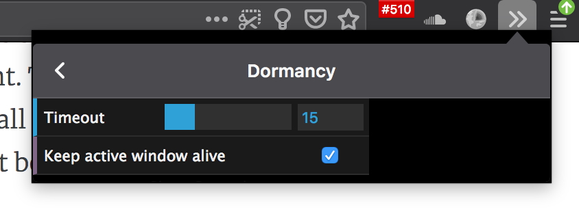
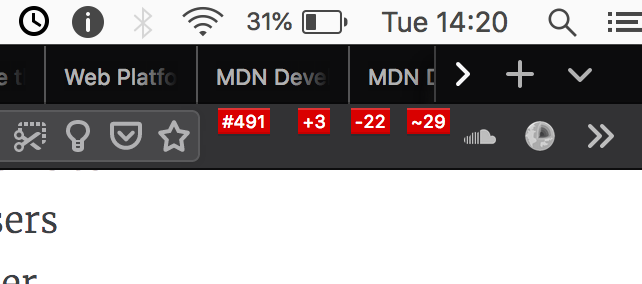

**We implemented session restore in Firefox 2, [thirteen years ago](https://bugzilla.mozilla.org/show_bug.cgi?id=328154).** This was back when we used CVS, automated tests weren't yet required, and everything we did was uphill both ways... in snow.

Tab unloading was a feature I *really* wanted, but it was lower priority, and discussions with our design team always went into the sarlaac pit of heuristics - when is the right time to unload the tab, without annoying the user by having to reload the page when they want it?

Being a [tab hoarder myself](https://metafluff.com/2017/07/21/i-am-a-tab-hoarder/), I wrote an extension that implements this feature for my own benefit, and also to learn a bit about what worked and didn't. I had to live without it for a bit after the great WebExtension migration, until the [right API was finally shipped](https://bugzilla.mozilla.org/show_bug.cgi?id=1128502) that supported the features I needed.

You can install this extension here: https://addons.mozilla.org/en-US/developers/addon/dormancy/edit

I'd like to share a few things I learned while making and running this extension.

**TL;DR: My optimal heuristics for tab unloading are "unload tabs 15 minutes after last focused" + "never unload tabs in active window".**

Here are my findings and recommendations for building a tab unloading feature. They're not exhaustive, just the set of things I learned in my experiments.

* Most important: Do not trust any ideas or assumptions you have about this. You must personally live with different heuristics for a few days or a week. Experience the pain of your assumptions. There's one assumption that is 100% correct: When this feature is tuned incorrectly, it is SUPER ANNOYING.

* Personal and team testing is not enough. Do some research with real users. Write a test extension, and a blog post where people can test and provide feedback. Get as diverse set of testers as possible, and trust their feedback.

* This is a feature for power users. The telemetry for tab-counts shows this to be true. The unloading heuristics should take that into account. The users who will ever see this feature in action are tiny subset of overall browser users, so it should be tuned specifically to their behavior. That behavior should be explored in the research (more on this below).

* Time-since-tab-was-focused is the most important heuristic for me. While running Dormancy, I learned that 5 minutes of inactivity on a tab is wayyyy too low.  I've settled on 15 minutes - it basically never surprises me, and I rarely experience a tab reload.

* Ignore-active-window is the second most important heuristic, but only matters for multi-window users obviously. IIRC our telemetry says there aren't many multi-window users... well, maybe not enough for defaults around this. But for people with multiple long-lived windows, keeping active window alive is *fantastic*.

About tab usage behavior - I've only scratched the surface of this. I wrote a few extensions that reflect my behavior dashboard-style in the toolbar so I can get a sense for levels of activity for different actions:

* [Show number of open tabs across all windows](https://addons.mozilla.org/en-US/firefox/addon/tab-count-button/)
* [Show number of tabs opened today](https://addons.mozilla.org/en-US/firefox/addon/tabs-opened-button/)
* [Show number of tabs closed today](https://addons.mozilla.org/en-US/firefox/addon/tabs-closed-button/)
* [Show number of tab switches today](https://addons.mozilla.org/en-US/firefox/addon/tabs-switched-button/)

These are shipped as separate extensions because you cannot adjust the width of toolbar icons, and I want all counts visible. They're all one extension, and the [source code is on Github](https://github.com/autonome/tabstatistics).

I've only done some basic counting, but research into more complex interactions and behavior should be done. For example, how people traverse tabs will determine whether the feature really works for them. If they use keyboard shortcuts to move across large sets of tabs, it will not be effective in single window mode using only a timeout, because the last-focused-time will constantly be reset.

If you'd like to learn more, there's [a bug filed for this feature](https://bugzilla.mozilla.org/show_bug.cgi?id=675539), with many years of discussion.
