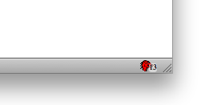

Earlier tonight, [Elisée](http://sparklin.org/ "Elisée on Twitter") came into [#jetpack](irc://irc.mozilla.org/#jetpack "#jetpack on IRC") with some questions, and we got to talking about badging on widgets. He'd built a solution for his project, but we both agreed it should be easier. It's something that we've gotten quite a few requests for, so using Elisée's approach, I made a standalone module for badging Widgets.

[Module source code (and example).](https://github.com/autonome/Jetpack-Modules/blob/master/BadgedWidget.js "Source code")

The BadgedWidget API allows you to specify badge text, background color, and background opacity. The API needs to be properly integrated into the core Widget object, should allow updating each property individually, and a few other niceties (full control over styling?). But for now, here's a bird in your hand. If you've got suggestions, let me know in the comments. Screenshot below.

