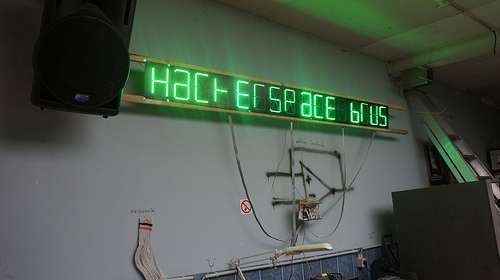
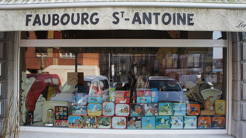
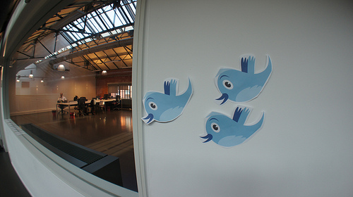

We're at the end of our Performance work-week here in Brussels, and gearing up for a two-day orgy of European open-source culture at FOSDEM. I've successfully acquired a cold (and hopefully not worse) due to the temperature being [consistently below freezing](http://j.mp/xUY8FQ).

However, the people here in Brussels have made up for their weather shortcomings by welcoming us wherever we go. Between the hackerspaces and co-working spaces, and the restaurants that happily take large groups with little or no notice, I'm very impressed!

**HSBXL**

The [hackerspace in Brussels](https://hackerspace.be/) is located in Schaerbeek, a neighborhood to the north of the city center. The space used to be a vehicle repair garage for the city, but was given up for use by the geeks. They've installed [serious hardware](http://www.flickr.com/photos/autonome/6800517943/in/photostream "oscillosock!"), and have fully-equipped the place with [everything needed for survival](http://www.flickr.com/photos/autonome/6800515533/in/photostream). Thanks to Rafael and Patrick, for answering all our questions and helping us make [mate](http://en.wikipedia.org/wiki/Mate_%28beverage%29) and to find food nearby. Lunch on the second day was described by Patrick as a "little French place", but turned out to be a hall of worship dedicated to Tintin!

Faubourg St Antoine is filled with Tintin toys, art and [knick-knacks](http://www.flickr.com/photos/autonome/6800526217/in/photostream/), including some [alternate](http://www.flickr.com/photos/autonome/6800525605/in/photostream/) interpretations and even a clarification for [something I'd always wondered about](http://www.flickr.com/photos/autonome/6800523647/in/photostream). Sadly, they've been issued a legal notice from the current copyright (or EU equivalent) holders requiring them to remove all the Tintin materials from public display :(

**BetaGroup Coworking**

Once the temperatures dropped far below freezing, we relocated to [BetaGroup Coworking Brussels](http://coworking.betagroup.be/) in Etterbeek, to the southeast of the center. [Ramon Suarez](https://twitter.com/#!/ramonsuarez), the manager of the space was very accommodating, taking us on short notice. The wi-fi was blazing fast, the coffee was hot, and the ping-pong was a welcome break from heads-down hackery. The space itself was fantastic, with a great combination of quiet co-working areas, public spaces and private meeting offices. With tons of natural light, [steel bridges](http://www.flickr.com/photos/autonome/6800566217/in/set-72157629096248615) and a meeting space on what looked like [a submarine conning tower](http://www.flickr.com/photos/autonome/6800567379/in/set-72157629096248615), it was truly impressive.

We had a wonderful lunch at a [very tidy restaurant](http://www.flickr.com/photos/autonome/6811646793/in/set-72157629096248615) nearby.

Overall, it's been a fun and productive week, if a bit chilly. Like, really chilly. Ridiculously so. Why do people even inhabit places that get this cold? Honestly, wtf.