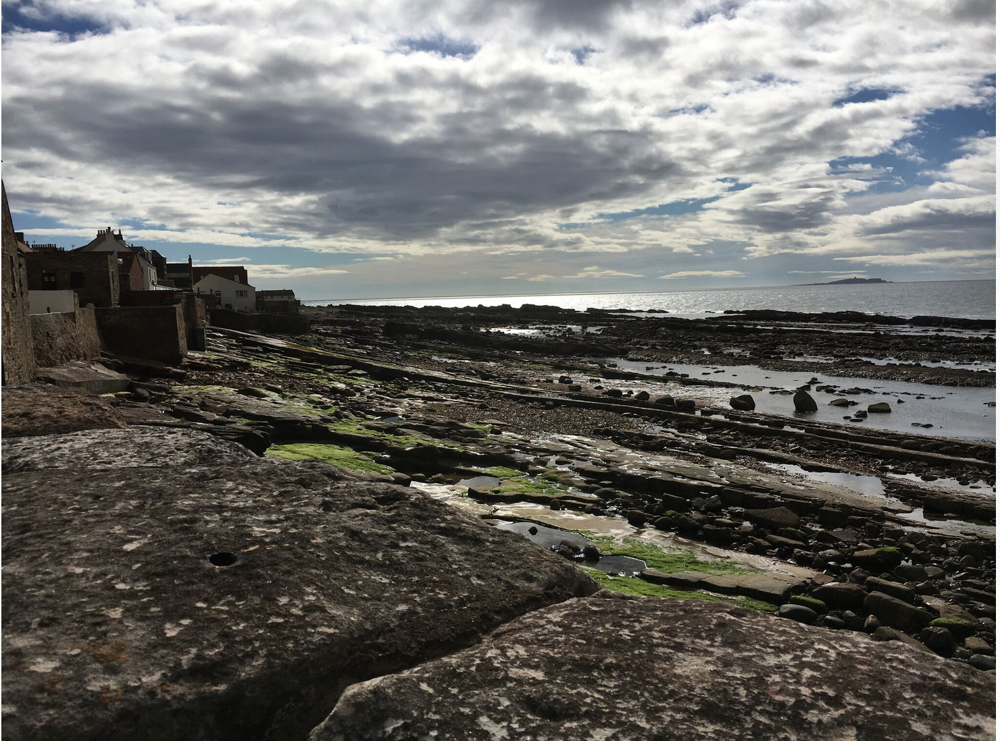
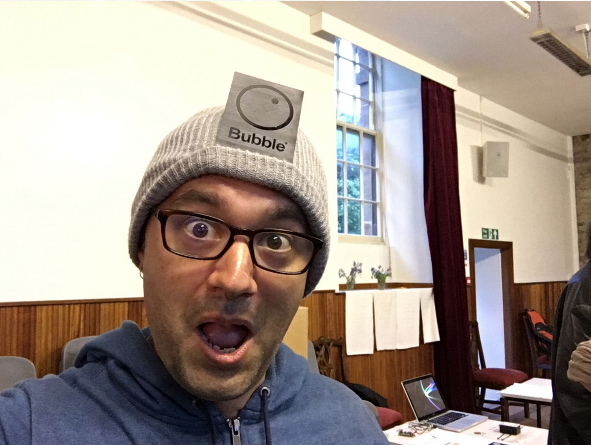
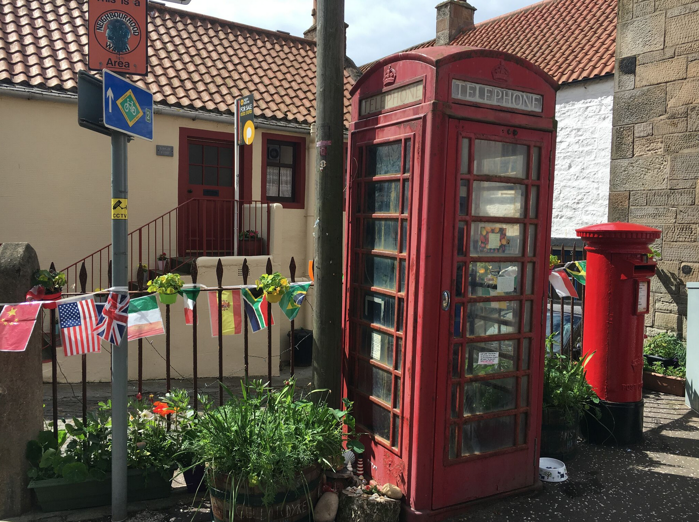
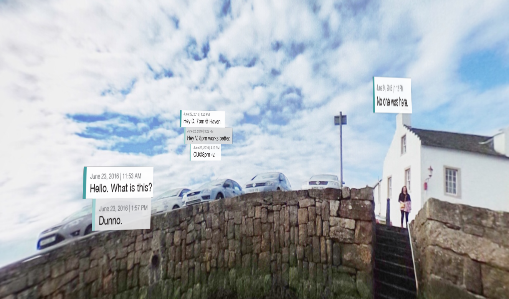
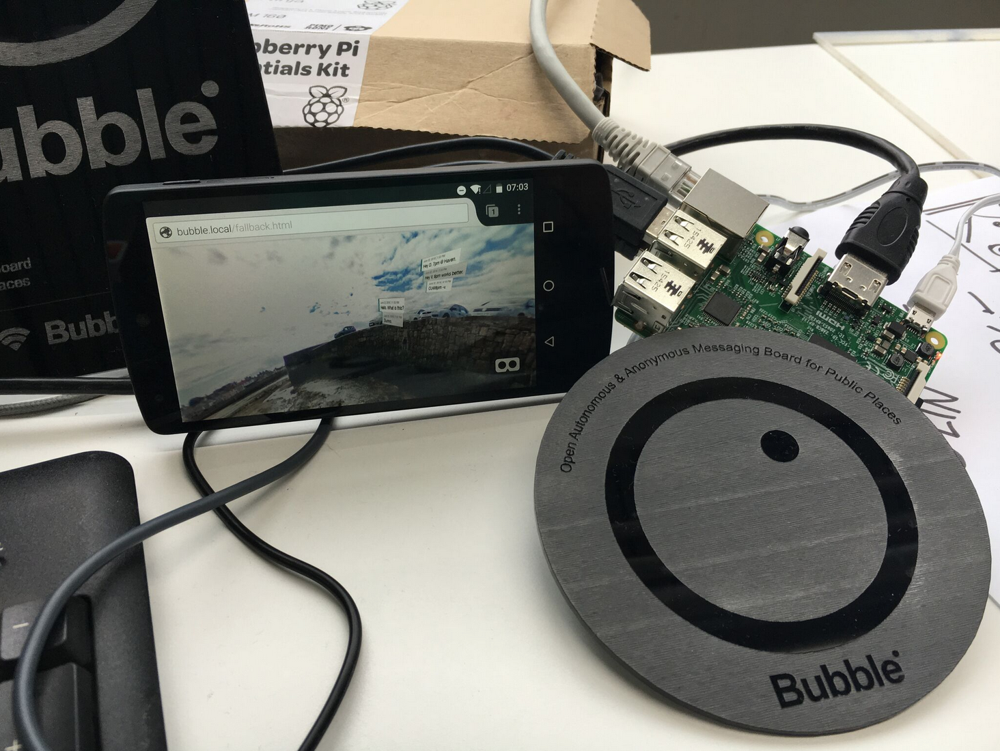
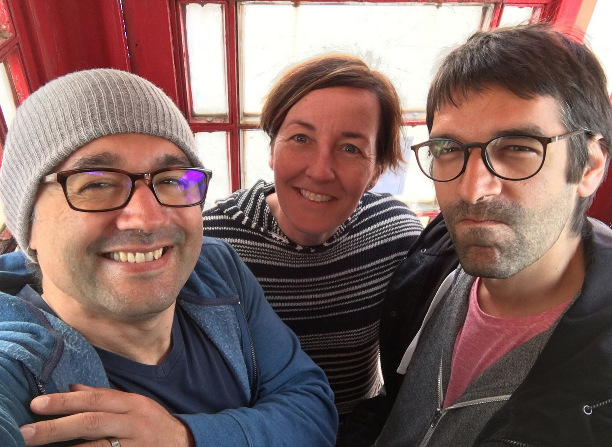

Last month I spent a week working on IoT projects with a group of 40 researchers, designers and coders... in Anstruther, a small fishing village in Scotland. Not a high-tech hub, but that was the point. We immersed ourselves in a small community with limited connectivity and interesting weather (and [fantastic F&C](https://www.tripadvisor.com/Restaurant_Review-g551743-d1898308-Reviews-The_Wee_Chippy-Anstruther_Fife_Scotland.html)) in order to explore how they use technology and how ubiquitous physical computing might be woven into their lives.

The ideamonsters behind this event were [Michelle Thorne](https://twitter.com/thornet) and [Jon Rogers](https://twitter.com/ileddigital), who are putting on a series of these exploratory events around the world this year as part of the Mozilla Foundation's [Open IoT Studio](https://wiki.mozilla.org/Open_IoT). The two previous editions of this event were a train caravan in India and a fablab sprint in Berlin (which I also attended, and will write up as well. I SWEAR.).

Michelle and Jon will be writing a proper summary of the week as a whole, so I'm going to focus on the project my group built: Bubble.

## **Context**

From research conducted with local fishing folk, farmers from a bit inland, and a group of teenagers from the local school, we figured out a few things:

*   **Mobile connectivity is sparse and unreliable** throughout the whole region. In this particular town, only about half the town had any service.
*   The important **information, places and things aren't immediately obvious** unless you know a local.
*   Just like I was, growing up in a small town: **The kids are just looking for something to do.**
Initially we focused on the teens... fun things like virtual secret messaging at the red telephone boxes. Imagine you connect to the wifi at the phone box, and the captive portal is a web UI for leaving and receiving secret messages. Perhaps they're only read once before dying, like a hyperlocal Snapchat. Perhaps the system is user-less, mediated only by secret combinations of emojis as keys. The street corner becomes the hangout, physically and digitally.

We meandered to public messaging from there, thinking about how there's so much to learn and share about the physical space. What's the story behind the messages to fairies that are being left in that phone box? I can see the island off the coast from here - what's it called and what's out there? Who the hell is Urquardt and what's a "wynd"? Maybe we make a public message board as well - disconnected from the internet but connected to anything within view.

We kept going back to the physical space. We talked about a virtual graffiti wall, and then started exploring AR and ways of marking up the surroundings - the people, the history, the local pro-tip on which fish and chips shop is the best. But all of this available only to people in close physical proximity.

## **Implementation**

Given the context and the constraints, as well as watching direction some of the other groups were going in, we started designing a general approach to bringing digital interactivity to disconnected spaces.

The first cut is **Bubble**: A **wi-fi access point** with a **captive portal** that opens a web page that displays an **augmented reality** view of your **immediate surroundings**, with messages overlaid on what you're seeing:

A few implementation notes:

*   We used a Raspberry Pi 3, running as a wi-fi access point.
*   It ran a node.js script that served up the captive portal web UI.
*   The web UI used getUserMedia to access the device camera awe.js for the AR bits and A-Frame for a VR backup view on iOS.
*   We designed a logo and descriptive text and then lasercut some plaques to put up where hotspots are.
**Designs, board, battery and boxes:**

**Connected to the front-end:**

**In the final box:**

**Challenges:**

*   Captive portals are hobbled web pages. You can't do things like use getUserMedia to get access to the camera.
*   iOS doesn't have *any* way to let web pages access the camera.
*   Power can be hard. We talked about solar and other ways of powering these.
*   Gotta hope they don't get nicked.
Bubble was an experimental prototype. There are no plans to work further on it at this time. If you're interested, everything is on Github [here](https://github.com/autonome/bubble). You can read more about the design [here (PDF)](https://www.dropbox.com/s/yj11w3g3scwu93q/Bubble_DesignSprint_Scotland.pdf?dl=0).

Thanks to fellow team members [Julia Gratsova](https://twitter.com/juliagratsova), [Katie Caldwell](https://twitter.com/kc_coffeekid), [Vladan Joler](https://twitter.com/thecreatureslab). (Sadly, no Julia in the phonebox!)

