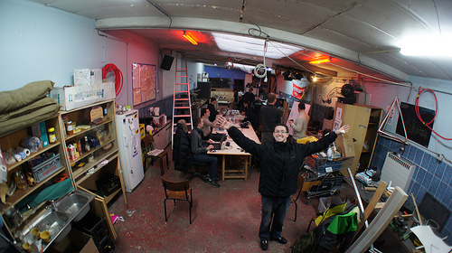

The Performance team and some of the Firefox team are spending the week in Brussels, laying waste to some of the performance issues in the browser.

Much thanks to our excellent hosts [HSBXL, a hackerspace in central Brussels](https://hackerspace.be/Main_Page). We're equipped with fast internet, lemon soda, [mate](http://en.wikipedia.org/wiki/Mate_%28beverage%29), techno music, and of course beer.

[youtube http://www.youtube.com/watch?v=AjHKGdzfe2s?rel=0]

Following the work week is FOSDEM, Europe's biggest open source conference. If you're in town for FOSDEM and want to come hack with us, [ping me on twitter](https://twitter.com/#!/dietrich) or join us in [#perf on IRC](irc://irc.mozilla.org/?channel=perf).

I'll be uploading pics to [flickr with the tag 'perfworkweek2012'](http://www.flickr.com/search/?q=perfworkweek2012&m=tags).