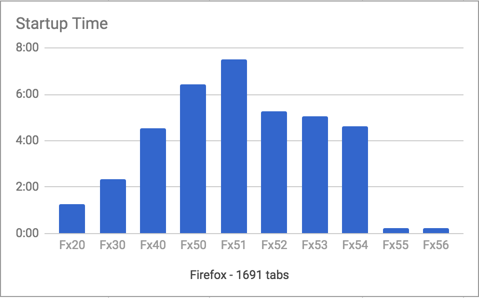
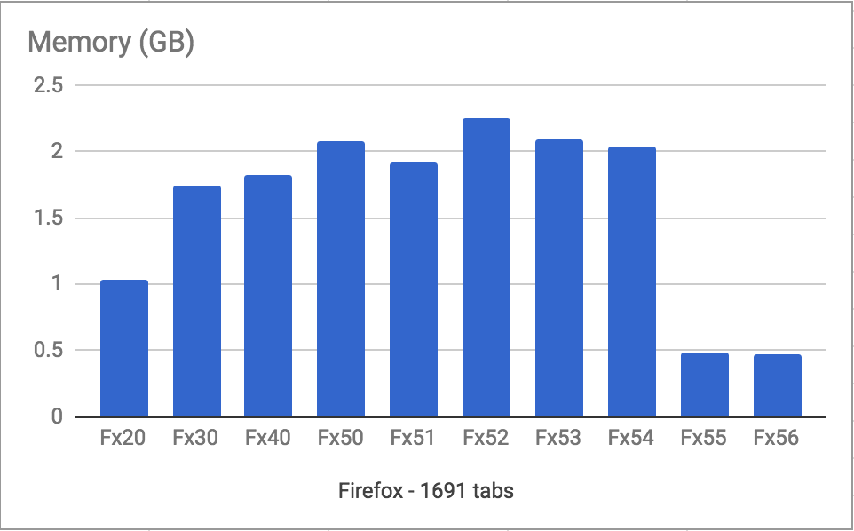

I've got a Firefox profile with 1691 tabs.

I started trying to write down why, but quit. It's not very useful. I'm an outlier, and that's fine.

If you are thinking to yourself "that's stupid, why would anyone do that!", you should probably stop reading. Find something nice to read that validates your assumptions about how all people should be, and enjoy your morning coffee.

All users are different, and each "misuse" of a software program is the reverberating echo of people trying to get things done. This is a story about using software how *I* think it *should* work.

In this case the software is Firefox, and it handled my behavio(u)r quite poorly for a long time. I got used to multi-minute startup time, waiting 15-30 seconds for tabs from external apps to show up, and all kinds of non-responsive behavio(u)r.

And then everything changed.

## Quantum Flow

Right now, more effort is being put into making Firefox fast than I've seen since... well, since I've been working on Firefox. And I've been at Mozilla for more than a decade.

Part of this effort is a project called Quantum Flow - a bunch of engineers making changes that directly impact Firefox responsiveness.
To learn more and follow along, check out the [collection of bugs](), and also read [Ehsan Akhgari's weekly newsletter posts](https://ehsanakhgari.org/tag/quantumflow).

A lot of the improvement in this particular scenario is from Kevin Jones' work on bringing the overall cost of unloaded tabs as close to zero as possible.
While the major work has landed, the work continues in [Bug 906076](https://bugzilla.mozilla.org/show_bug.cgi?id=906076).
Huge amounts of thanks for the recent wins for us pathological tab hoarders go to Kevin, Dão Gottwald, Mike de Boer, Tim Taubert, David Teller, Mike Conley, and Gijs Kruitbosch.

## Test Scenario

I took my 1691 tab browser profile, and did a wall-clock measurement of start-up time and memory use for Firefox versions 20, 30, 40, and 50 through 56.

These are my personal results. You might not get the same results. If you test 1691 (or even 1692) tabs and find something totally different, I'd love to hear about it.

Notes:

* I shut down most things on my Macbook (yeah the little one that's more like a glorified iPad).

* I turned off wifi. This is a measurement of *Firefox*, not the network.

* I measured by eyeball, using "time cat" on the command line. I'm totally ok with how coarse the numbers are. I'm measuring *minutes*, so microsecond precision is not required.

* I measured startup time five times, dropping highs and lows. Even that wasn't really necessary - the times were *startingly consistent*. With almost 1700 tabs and >5 minute startup, the standard deviation was negligible.

* For startup, I measured up until the "server not found" page showed up in the active tab. After lots of testing, I found this to be the point at which the application became responsive and usable.

* For memory, I waited until one minute after the startup measurement point and then grabbed the total value from the bottom of about:memory. I waited one minute, because I observed a consistent spike in memory after startup which went away within the first minute and then stabilized for a long period after. It's all kinds of initialization that doesn't need to block the app from starting, but needs to happen once you get to browsing.

* I tested Firefox versions 20, 30, 40, and 50 through 56. I tried testing Firefox 10 but it permahung while loading the profile.

## Start-up Time

Here's a graph of startup time across Firefox versions:

Interesting to note:

* We consistently got *worse* over time until Firefox 51. It'd be interesting to do this test with varying numbers of tabs and find out at what point the regressions become noticeable.

## Memory Usage

## Why This is Important

Browser vendors use telemetry, user research and a number of other ways of determining "acceptable use" of their products. Anything outside of that idea of acceptable use is generally unsupported.

For example, Mozilla found some years ago that the ceiling of the number of tabs for most users of Firefox was 15. Most people had far fewer tabs than that. While I interpret that as a failure of tabs as a functional metaphor for managing web pages in a single application, it's generally been used a functionality scope for what the browser should support and be performant for.

* power user long tail
* tab groups, alternate models

