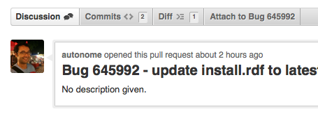
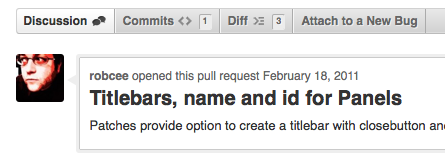

I updated the add-on to either show which bug it'll add the patch to, or link to the Enter Bug page on Bugzilla. If you choose to create a new bug, the Bugzilla page will open in a new tab.

The "new bug" scenario is still far too bumpy, requiring you to go to a new tab, get the new bug number, go back to the pull request page, update the pull request title, and then reload the page. Maybe in the next version we could put the new bug page in a panel in the current tab, and then automatically submit the attachment after the bug is created?

[Install](http://j.mp/dYtZbs).

Screenshot of bug detected:

Screenshot of no bug detected:

