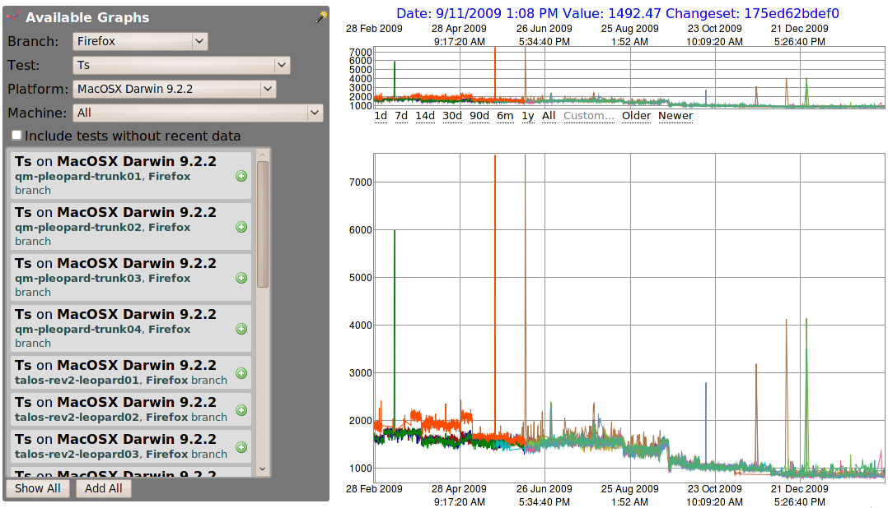

The [graph server](http://graphs.mozilla.org/) is a powerful tool for visualizing the results of our performance tests over time. However, it has a few major problems that make using it in it's current form difficult. It also lacks a few features that would make it far more useful for tasks such as regression-finding. I and a few other people are looking into improving the graph server. Before starting though, we need to know how you use the graph server, and your ideas for how the interface could be improved, so please let me know your thoughts in the comments!

